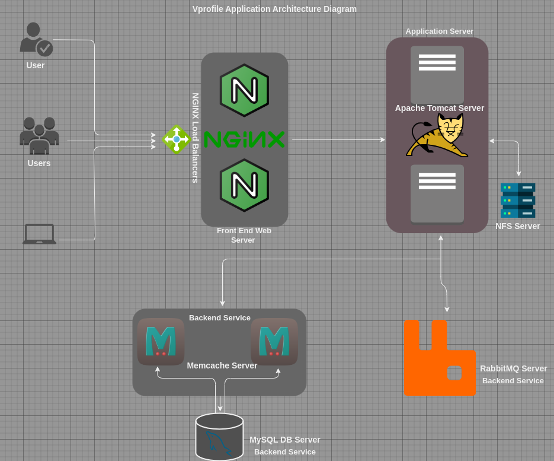

# Vprofile project on prem
## 1. Manual Provisioning
### Intro

There are a number of services/components that powers the vprofile Java web app. This entails having a run book to set up the project stack. This is an attempt to document the whole project. The project is to set up a web application.

### Objectives

- Learn VM automation locally
- Act as a baseline for upcoming projects
- Real world scenario setup on prem/local machine for R&D.

### Vprofile Project Application Stack Diagram

  
### Project setup

- **Scenario**
  - Problem 
    - You have a requirement to make changes to production environment but you lack confidence to make those changes live and you want to create your own sandbox.
    - Local setup is complex.
    - Time consuming and not repeatable.
  - Solution
    - Have an automated local setup.
    - Use IAC so it's repeatable.
  
- **Tools**
  - Local environment setup
    - Hypervisor - Oracle VM VirtualBox
    - Automation - Vagrant
    - CLI - bash, for a quick brush up, check [here](https://github.com/bobbyiliev/introduction-to-bash-scripting?tab=readme-ov-file)
    - IDE - Visual Studio Code or your preference

- **Hardware Requirements**
  
  These are RAM requirements for each virtual machine to run smoothly:

  - Min:
    600 MB 
  - Recommended: 
    1 GB
   
- **The Architecture of Project Services**

  - NGINX
  - TOMCAT
  - RABBITMQ
  - MEMCACHED
  - MYSQL

- **The Architecture of the Automated Setup**

  - Vagrant
  - VirtualBox
  - Bash
  - Scripts

  **Note**: On Windows install [Cygwin](https://geekflare.com/cygwin-installation-guide/) or [Git Bash](https://gitforwindows.org/) for Command Line Interface (CLI)

### User Experience Flow

- User opens a browser and enter the IP of a load balancer that routes the request to Tomcat server.
- Apache Tomcat is a Java web application service that hosts apps written in Java.
- If there is need for a shared storage or centralized storage the we will use NFS.
- The user login details will be stored in MySQL database service. A user attempts to login, the Tomcat app will run an SQL query to access user info stored in MySQL database server the return traffic gets cached by the Memcache Database service.
- The user query will be sent back to Tomcat and then cached in Memcached so that the use gets validated using the caching service instead.
- RabbitMQ is a message broker/queuing agent service that streams data between to services.

### Flow of Execution

1. Set up tools mentioned above
2. Clone source code [here](https://github.com/hkhcoder/vprofile-project.git)
3. *cd* into the vagrant directory [here](/vprofile-local-env/vagrant/Manual_provisioning_WinMacIntel/) for Linux/Win/MacIntel and [here](/vprofile-local-env/vagrant/Manual_provisioning_MacOSM1/) for MacOSM1 
4. Bring up the VMs
5. Validate all VMs
6. Set up All the services
     - MySQL
     - Memcached
     - Rabbit MQ
     - Tomcat
     - Nginx
     - App Build and Deploy in Tomcat Server
7. Verify from browser

### Vagrant Application Stack Provisioning

Before you start, make sure that you have installed VirtualBox and Vagrant on your local environment by following the Windows instructions [here](https://github.com/neikei/install-vagrant-on-windows?tab=readme-ov-file) and [here](https://developer.hashicorp.com/vagrant/install) for other operating systems. If you are new to Vagrant then use this [Vagrant crash course](https://gist.github.com/yeukhon/b35d94f4aa859a5477e4).

### Services

1. Nginx => Web Server
2. Tomcat => Application Server
3. RabbitMQ => Broker/Queuing Agent
4. Memcache => DB Caching
5. ElasticSearch => Indexing/Search Service* will not be deployed, just for reference.
6. MySQL => SQL Database

### Order of Service Execution
Setup should be done in this order.
1. MySQL (Database SVC)
2. Memcache (DB Caching SVC)
3. RabbitMQ (Broker/Queue SVC)
4. Tomcat (Application SVC)
5. Nginx (Web SVC)

For step by step commands reference for each vagrant box refer [here](./vagrant/Manual_provisioning_WinMacIntel/VprofileProjectSetupWindowsAndMacIntel.pdf). To brush up on SQL, go [here](https://sqlcrashcourse.com/). Though not necessary for this project.

Note: Additionally, regarding "db01" vagrant box setup, when configuring Mariadb database refer to [How to Install and Secure MariaDB in RHEL 9
](https://jumpcloud.com/blog/how-to-install-mariadb-rhel-9). Just in case the PDF above is not as clear enough to you.

Verify in the browser by getting the IP address of "web01" server. To log into the app, use:

username; 

    admin_vp

password;

    admin_vp

Check other services like RabbitMQ, Memcached, etc. 

Once logged in, you can click on a user and check if memcache cached the user and also check RabbitMQ if it queued any requests. If you managed to see the web app, it means Nginx was deployed successfully, if you logged in with the credentials above, it means your request was authenticated successfully against MyQSL, congratulations! You just deployed the app on prem.

## 2. Automatic Provisioning

Open either [here](/vprofile-local-env/vagrant/Automated_provisioning_WinMacIntel/) for Linux/Windows/MacIntel or [here](/vprofile-local-env/vagrant/Automated_provisioning_MacOSM1/) for MacOSM1 folder depending on your OS.

a. The Vagrantfile in it, is slightly different, it points to scripts for each service, e.g. "mysql.sh", memcache.sh", etc.

b. Change directory into;

    /DevOps-Projects/vprofile-project-local/vagrant/Automated_provisioning_WinMacIntel
c. Then just run;

     vagrant up

d. After all all the servers are up. SSH into the "web01" and get the IP of the server and then verify in the browser.

e. Verify in the browser by getting the IP address of "web01" server. 
   To log into the app, use:
   
   username;
  
    admin_vp

  password;
    
    admin_vp

  Check other services like RabbitMQ, Memcached, etc. 

Once logged in, you can click on a user and check if memcache cached the user and also check RabbitMQ if it queued any requests. If you managed to see the web app, it means Nginx was deployed successfully, if you logged in with the credentials above, it means your request was authenticated successfully against MyQSL, congratulations! You just deployed the app on prem.

## Sources & References
- [DevOps Beginners to Advanced with Projects](https://www.udemy.com/course/decodingdevops/?couponCode=LEADERSALE24A) by Imran Teli
- [Vprofile Source Code](https://github.com/hkhcoder/vprofile-project) by Imran Teli (hkhcoder)
- [Vagrant crash course](https://gist.github.com/yeukhon/b35d94f4aa859a5477e4) by Yeuk Hon Wong
- [DevOps Notes](https://visualpath.in/devopstutorials/devops) by Imran Teli
- [Install-vagrant-on-windows](https://www.itu.dk/people/ropf/blog/vagrant_install.html) by Neikei
- [Install Vagrant](https://developer.hashicorp.com/vagrant/install) by Harshcorp
- [Architecture Diagramming](https://www.drawio.com/) courtesy of draw.io application
- [How to Install and Secure MariaDB in RHEL 9](https://jumpcloud.com/blog/how-to-install-mariadb-rhel-9) by David Worthington
- [Bash Scripting Intro](https://github.com/bobbyiliev/introduction-to-bash-scripting?tab=readme-ov-file) by 
bobbyiliev
- [SQL Crash Course](https://sqlcrashcourse.com/) by Alan Hylands

  